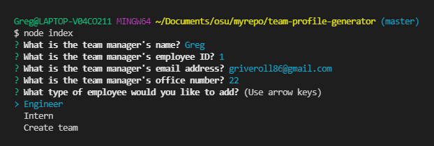
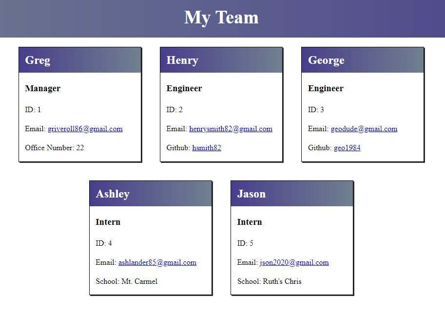

# Team Profile Generator

## Demonstration Videos
* [Application Video](https://watch.screencastify.com/v/ivMVuyPWSlnrLHubj9lL)
* [Testing Video](https://watch.screencastify.com/v/tLloK3GFquQxwSGvrV7b)

## Overview
This application uses Node.js CLI to ask a user questions about a work team and generates an HTML file based on the answers; tests are included to check the functionality of the application. The Inquirer package handles the questions and the Jest package handles the tests. Answering the questions will generate an HTML file in the 'output' folder. Along with the included 'style.css' file (also in the 'output' folder) a team profile page is created with the employee's name, ID, Email, office number for the manager, github link for engineers and school name for interns. The page created includes interactive links for email and github pages.

## To Begin
To begin using this application, users should fork this repository, open the terminal at this location and use these commands to ensure everything is installed:
```Bash
npm install
```
```Bash
npm i inquirer
```
```Bash
npm i jest
```
These commands will ensure all dependencies the application requires are installed and up to date. To start the application, use command:
```Bash
node index.js
``` 
To run the tests, use command:
```Bash
npm test
``` 

## Technologies Used
* Node.js
* Inquirer
* Jest
* Javascript

## Preview

